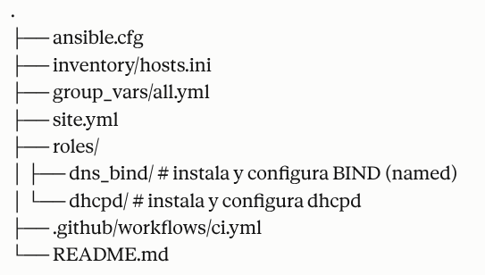

# TareaAnsibleDHCP-DNS-InfraestructuraIII

**Daniela Castaño Moreno - A00401805**

# ansible-rocky9-dns-dhcp

Playbook de Ansible idempotente para instalar y configurar **DNS (BIND/named)**
y **DHCP (dhcpd/ISC)** en **Rocky Linux 9**, con zonas forward/reverse,
firewalld, notas de SELinux y validaciones automáticas (`named-checkconf`,
`named-checkzone`, `dhcpd -t`).

## Requisitos

- Rocky Linux 9 en los hosts objetivo
- Ansible >= 2.14 en el nodo de control
- Colección `ansible.posix` (usada por el módulo `firewalld`):
```bash
  ansible-galaxy collection install ansible.posix
```
- Acceso SSH + `become` (sudo) al host objetivo
- Conectividad de red hacia el/los host(s) definidos en `inventory/hosts.ini`

## Estructura del repositorio

.
├── ansible.cfg
├── inventory/hosts.ini
├── group_vars/all.yml
├── site.yml
├── roles/
│ ├── dns_bind/ # instala y configura BIND (named)
│ └── dhcpd/ # instala y configura dhcpd
├── .github/workflows/ci.yml
└── README.md



## Variables principales (`group_vars/all.yml`)

| Variable | Descripción | Ejemplo |
|---|---|---|
| `domain_name` | Dominio interno autoritativo | `example.local` |
| `dns_server_hostname` | Hostname del servidor DNS/DHCP | `ns1` |
| `dns_server_ip` | IP del servidor DNS/DHCP | `192.168.10.10` |
| `reverse_zone` | Zona reversa `in-addr.arpa` | `10.168.192.in-addr.arpa` |
| `dns_forwarders_enabled` | Habilita forwarders | `true` |
| `dns_forwarders` | Lista de forwarders externos | `[8.8.8.8, 1.1.1.1]` |
| `dns_recursion` | Habilita recursión | `true` |
| `dns_allow_query` | ACL de consultas permitidas | `["any"]` |
| `dns_listen_on` | Interfaces/IPs donde escucha named | `["any"]` |
| `dns_serial` | Serial de zona (`YYYYMMDDnn`) | `2026090401` |
| `dns_records_a` | Lista de registros A (`name`, `ip`) | ver `group_vars/all.yml` |
| `dns_records_ptr` | Lista de registros PTR (`ip_last_octet`, `hostname`) | ver `group_vars/all.yml` |
| `dhcp_interface` | Interfaz donde escucha dhcpd (vacío = autodetección) | `""` |
| `dhcp_domain_name` | Dominio anunciado por DHCP | `{{ domain_name }}` |
| `dhcp_domain_name_servers` | DNS anunciados por DHCP | `["192.168.10.10"]` |
| `dhcp_default_lease_time` / `dhcp_max_lease_time` | Tiempos de lease (seg) | `600` / `7200` |
| `dhcp_subnets` | Lista de subredes (network, netmask, range_start/end, routers, broadcast) | ver `group_vars/all.yml` |
| `dhcp_reservations` | Reservas opcionales por MAC (`name`, `mac`, `ip`) | `[]` |
| `manage_firewalld` | Gestiona reglas de firewalld | `true` |

## Selección de interfaz DHCP en Rocky 9 (método elegido)

Rocky 9 puede nombrar interfaces de forma predecible (`ens192`, `enp0s3`, etc.)
según el hardware/hypervisor, por lo que **no se debe hardcodear `eth0`** sin
verificar.

**Método usado en este repo:**

1. Si defines explícitamente `dhcp_interface` (ej. `"ens192"`), el rol usa
   ese valor tal cual.
2. Si `dhcp_interface` queda vacío (`""`, valor por defecto), el rol
   autodetecta la interfaz con el hecho de Ansible `ansible_default_ipv4.interface`
   (la interfaz de la ruta por defecto), y la fija en `dhcp_interface_effective`.
3. Ese valor se escribe en `/etc/sysconfig/dhcpd` como `DHCPDARGS="<interfaz>"`,
   que es el mecanismo soportado por el `.service` de `dhcpd` en RHEL/Rocky 9
   (systemd unit `dhcpd.service` lee `/etc/sysconfig/dhcpd`).

Esto es estable porque no depende de nombres fijos tipo `eth0` (obsoletos en
RHEL9 con `biosdevname`/`predictable network interface names`), y es
explícito/override-able vía variable si tu topología tiene varias NIC.

## SELinux (nota operativa)

- Este playbook **no deshabilita SELinux**; asume `enforcing` (default Rocky 9).
- Los paquetes `bind` y `dhcp-server` traen políticas SELinux que ya permiten
  sus puertos estándar (`named_port_t` para 53, `dhcpd_port_t` para 67), por
  lo que normalmente **no se requiere `semanage port`**.
- Se ejecuta `restorecon -Rv` sobre el directorio de zonas (`/var/named`) tras
  desplegar los archivos, para asegurar el contexto correcto
  (`named_zone_t`) si los ficheros se crearon con otro contexto.
- Si usas rutas no estándar para zonas o `dhcpd.conf`, revisa contextos con:
```bash
  ls -Z /var/named/
  ls -Z /etc/dhcp/dhcpd.conf
```
  y ajusta con `semanage fcontext` + `restorecon` si es necesario.

## Uso

1. Editar `inventory/hosts.ini` con tu(s) host(s) real(es).
2. Editar `group_vars/all.yml` con tus valores (dominio, IPs, subredes, etc.).
3. Verificar sintaxis:
```bash
   ansible-playbook site.yml --syntax-check
```
4. Ejecutar en modo *check* (dry-run) antes de aplicar:
```bash
   ansible-playbook site.yml --check --diff
```
5. Aplicar de verdad:
```bash
   ansible-playbook site.yml
```

## Idempotencia

- Todos los pasos usan módulos declarativos (`package`, `template`,
  `service`, `lineinfile`, `file`, `firewalld`).
- Los únicos `command` son de **validación** (`named-checkconf`,
  `named-checkzone`, `dhcpd -t`, `restorecon`), todos con `changed_when`
  controlado para no reportar cambios falsos.
- Los `handlers` solo se disparan cuando cambian las plantillas
  (`named.conf`, zonas, `dhcpd.conf`, `sysconfig/dhcpd`).
- Ejecutar el playbook dos veces seguidas debe dar `changed=0` en la segunda
  corrida (salvo drift externo).

## Checklist de verificación

**Lint (si tienes `ansible-lint` instalado):**
```bash
pip install ansible-lint
ansible-galaxy collection install ansible.posix
ansible-lint site.yml
```

**Sintaxis del playbook:**
```bash
ansible-playbook site.yml --syntax-check
```

**Ejecución en check mode (sin aplicar cambios):**
```bash
ansible-playbook site.yml --check --diff
```

**Validación manual de DNS en el host objetivo:**
```bash
sudo named-checkconf /etc/named.conf
sudo named-checkzone example.local /var/named/example.local.zone
sudo named-checkzone 10.168.192.in-addr.arpa /var/named/10.168.192.in-addr.arpa.zone
```

**Validación manual de DHCP en el host objetivo:**
```bash
sudo dhcpd -t -cf /etc/dhcp/dhcpd.conf
```

**Verificación de servicios y puertos:**
```bash
sudo systemctl status named dhcpd
sudo ss -lntup | grep -E ':53|:67'
sudo firewall-cmd --list-services
sudo firewall-cmd --list-all
```

**Prueba funcional de resolución DNS:**
```bash
dig @192.168.10.10 ns1.example.local
dig @192.168.10.10 -x 192.168.10.20
```

## Licencia

MIT (ajustar según preferencia del maintainer).


### Si se quiere verificar su funcionamiento probar el siguiente

## Checklist de verificación
# 1) ansible-lint
pip install ansible-lint
ansible-galaxy collection install ansible.posix
ansible-lint site.yml

# 2) Sintaxis + ejecución en check mode
ansible-playbook site.yml --syntax-check
ansible-playbook site.yml --check --diff

# 3) Validación named / dhcpd (en el host gestionado, tras aplicar)
sudo named-checkconf /etc/named.conf
sudo named-checkzone example.local /var/named/example.local.zone
sudo named-checkzone 10.168.192.in-addr.arpa /var/named/10.168.192.in-addr.arpa.zone
sudo dhcpd -t -cf /etc/dhcp/dhcpd.conf

# 4) Verificación de puertos/servicios
sudo systemctl status named dhcpd
sudo ss -lntup | grep -E ':53|:67'
sudo firewall-cmd --list-services


---

# DHCP + DNS consolidado en Rocky Linux 9

Playbook de Ansible idempotente que instala y configura **DNS (BIND/named)**
y **DHCP (dhcpd)** en una única VM (`192.168.56.107`, dominio
`dhcpdnsdaniela.castanomor.local`) y convierte la segunda VM en **cliente DHCP**.

## Requisitos

```bash
ansible-galaxy collection install ansible.posix community.general
```

- Rocky Linux 9 en ambos hosts
- Ansible >= 2.14
- Acceso SSH + sudo

## Escenario

- **`dnsdhcp01` (192.168.56.107)**: corre `named` + `dhcpd` a la vez.
- **`client1`**: pierde cualquier rol de servidor que tuviera antes
  (se detienen/deshabilitan `named`/`dhcpd` si existían) y pasa a obtener
  su IP por DHCP.

## ⚠️ Sobre la IP estática del cliente y el DHCP

Si `client1` tiene hoy una IP fija configurada (`ipv4.method=manual` en
NetworkManager), **no va a empezar a usar DHCP solo porque el servidor ya
esté funcionando** — hay que cambiar explícitamente su perfil de conexión a
`method=auto`. Eso lo hace el rol `dhcp_client` con `community.general.nmcli`.

Dos riesgos a evitar:

1. **Colisión de IP**: si la IP estática actual del cliente cae dentro del
   `range` del `dhcpd.conf`, el servidor podría ofrecérsela a otra máquina
   más adelante. Por eso esa IP está **reservada por MAC** en
   `dhcp_reservations` (ajusta la MAC real en `group_vars/all.yml`).
2. **DHCP duplicado ("rogue")**: si `client1` era antes uno de los dos
   servidores originales y tenía `dhcpd` activo, debe quedar apagado
   (lo hace este rol) para que solo `dnsdhcp01` responda en la red.

Tras aplicar el playbook, verifica que el inventario (`ansible_host` de
`client1`) sigue siendo válido: como está reservado por MAC, debería
recibir siempre la misma IP.

## Selección de interfaz DHCP en Rocky 9

Si `dhcp_interface` queda vacío, el rol autodetecta la interfaz con
`ansible_default_ipv4.interface` y la escribe en `/etc/sysconfig/dhcpd`
(`DHCPDARGS="<interfaz>"`), mecanismo leído por la unidad systemd
`dhcpd.service` en RHEL/Rocky 9. Puedes forzarla con `dhcp_interface: "ens192"`.

## SELinux

No se deshabilita. Los paquetes `bind` y `dhcp-server` traen políticas que
ya cubren sus puertos estándar (`named_port_t` 53, `dhcpd_port_t` 67). Se
ejecuta `restorecon -Rv /var/named` tras desplegar zonas.

## Uso

```bash
ansible-playbook site.yml --syntax-check
ansible-playbook site.yml --check --diff
ansible-playbook site.yml
```

## Idempotencia

- Módulos declarativos (`package`, `template`, `service`, `lineinfile`,
  `firewalld`, `nmcli`).
- Los únicos `command`/`ansible.builtin.command` son de **validación**
  (`named-checkconf`, `named-checkzone`, `dhcpd -t`, `restorecon`, `nmcli ...show`),
  todos con `changed_when: false` o comparación explícita de salida.
- Los `handlers` solo disparan si cambian plantillas o la conexión de red.
